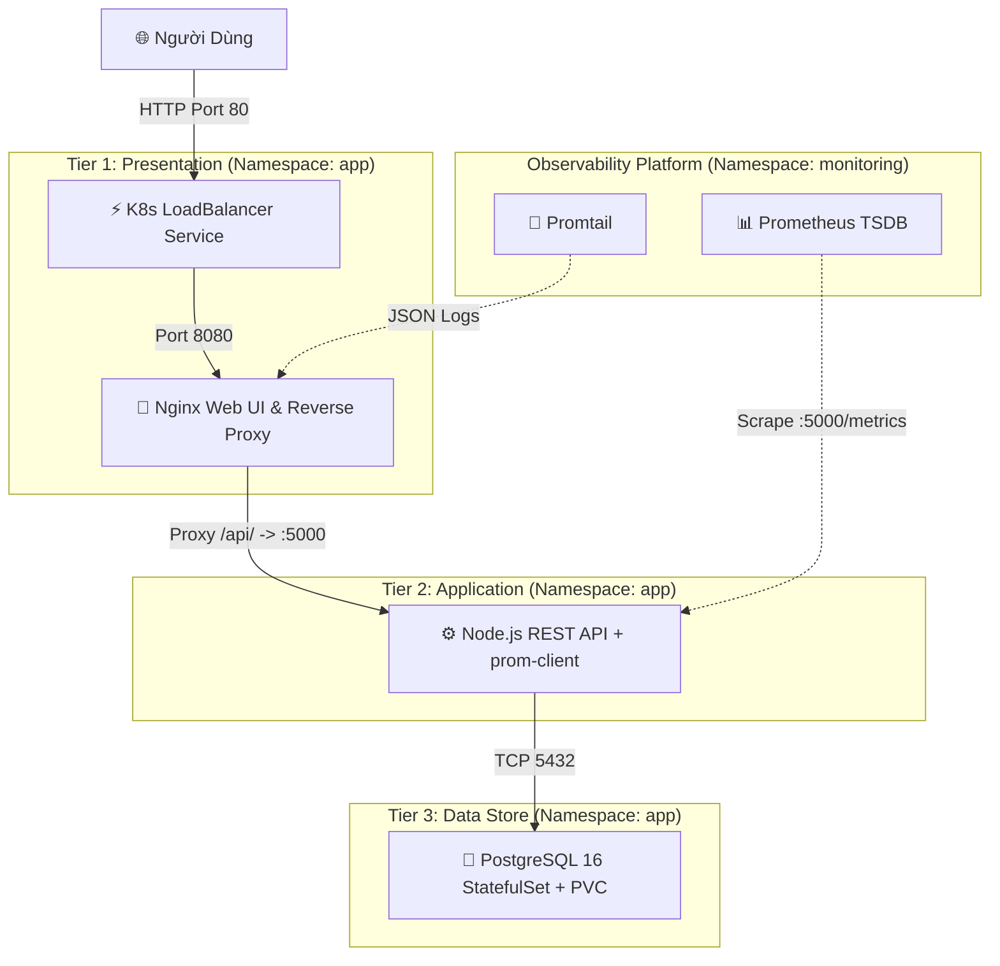

# 3-Tier Microservices Car Service Platform on Kubernetes

> Ứng dụng dịch vụ xe phân tán chuẩn kiến trúc 3-Tier (Frontend Nginx, Backend Node.js REST API tích hợp Prometheus SDK, và Database PostgreSQL StatefulSet) triển khai trên Kubernetes.

[](https://kubernetes.io/)
[](https://nodejs.org/)
[](https://www.postgresql.org/)
[](https://nginx.org/)
[](https://prometheus.io/)
[](https://github.com/features/actions)

---

## 📑 Mục Lục
1. [Tổng Quan Kiến Trúc](#-tổng-quan-kiến-trúc)
2. [Cấu Trúc Thư Mục](#-cấu-trúc-thư-mục)
3. [Chạy Cục Bộ Với Docker Compose](#-chạy-cục-bộ-với-docker-compose)
4. [Triển Khai Trên Kubernetes](#-triển-khai-trên-kubernetes)
5. [Telemetry & Metrics Ứng Dụng](#-telemetry--metrics-ứng-dụng)
6. [Điểm Nhấn Cho CV](#-điểm-nhấn-cho-cv)
7. [Tác Giả](#-tác-giả)

---

## 🏛️ Tổng Quan Kiến Trúc (3-Tier Decoupled)



### Các Tầng Hệ Thống:
* **Tier 1 (Presentation):** Nginx unprivileged non-root (UID 101), phục vụ giao diện Web và đóng vai trò Reverse Proxy điều hướng request `/api/` vào Backend.
* **Tier 2 (Application):** Node.js Express REST API, tích hợp thư viện `prom-client` xuất trực tiếp các chỉ số RED Method (Rate, Errors, Duration) tại `/metrics`.
* **Tier 3 (Data Store):** PostgreSQL 16 triển khai bằng StatefulSet, lưu trữ bền vững qua PersistentVolumeClaim (PVC 5Gi).

---

## 📂 Cấu Trúc Thư Mục

```text
k8s-car-service-app/
├── .github/workflows/
│   └── ci-cd.yml                 # CI/CD: Hadolint, Kubeconform, Trivy Scanner
├── frontend/                     # Tier 1: Nginx Web UI & Reverse Proxy
│   ├── src/                      # HTML, CSS, JavaScript
│   ├── nginx.conf                # Cấu hình Reverse Proxy & Log JSON
│   └── Dockerfile                # Image Nginx Alpine unprivileged (UID 101)
├── backend/                      # Tier 2: REST API & Prometheus SDK
│   ├── src/
│   │   ├── app.js                # API server & endpoints
│   │   ├── db.js                 # PostgreSQL connection pool
│   │   └── metrics.js            # prom-client metrics registry
│   ├── package.json
│   └── Dockerfile                # Image Node.js 18 Alpine (UID 1001)
├── k8s/                          # Kubernetes Manifests
│   ├── 00-namespace.yaml         # Namespace "app"
│   ├── 01-database/              # Manifests cho PostgreSQL (Secret, PVC, StatefulSet, Service)
│   ├── 02-backend/               # Manifests cho Backend API (ConfigMap, Deployment, Service, HPA)
│   └── 03-frontend/              # Manifests cho Frontend (Deployment, Service, PDB)
├── docker-compose.yml            # Khởi chạy fullstack 3-Tier chỉ với 1 lệnh
└── README.md                     # Tài liệu hướng dẫn
```

---

## 🐳 Chạy Cục Bộ Với Docker Compose

Chạy toàn bộ 3 tầng (Database, Backend API, Frontend) trên máy cá nhân:

```bash
# Khởi động dịch vụ
docker compose up -d

# Kiểm tra trạng thái
docker compose ps
```

* **Frontend UI:** `http://localhost`
* **Backend API:** `http://localhost:5000/api/v1/services`
* **Prometheus Metrics:** `http://localhost:5000/metrics`
* **Health Check:** `http://localhost:5000/healthz`

---

## ☸️ Triển Khai Trên Kubernetes

Thực hiện áp dụng manifests theo thứ tự từng tầng:

```bash
# 1. Khởi tạo Namespace
kubectl apply -f k8s/00-namespace.yaml

# 2. Triển khai Tier 3: Database PostgreSQL
kubectl apply -f k8s/01-database/

# 3. Triển khai Tier 2: Backend REST API
kubectl apply -f k8s/02-backend/

# 4. Triển khai Tier 1: Frontend Web
kubectl apply -f k8s/03-frontend/
```

### Kiểm Tra Trạng Thái Cụm:
```bash
kubectl get all,pvc,pdb,hpa -n app
```

---

## 📈 Telemetry & Metrics Ứng Dụng

Backend API được nhúng sẵn Prometheus Client SDK (`prom-client`), tự động thu thập và xuất các chỉ số tại endpoint `/metrics`:

| Tên Metric | Kiểu Metric | Ý Nghĩa / Mục Đích |
| :--- | :--- | :--- |
| `http_requests_total` | Counter | Tổng số HTTP requests phân loại theo `method`, `route`, `status_code`. |
| `http_request_duration_seconds` | Histogram | Phân phối thời gian phản hồi của API (p50, p95, p99). |
| `db_queries_total` | Counter | Tổng số câu truy vấn PostgreSQL thành công hoặc thất bại. |
| `active_service_bookings_total` | Gauge | Số lượng lịch bảo dưỡng xe đang hoạt động trong database. |

---

## 🌟 Điểm Nhấn Cho CV

* **Kiến Trúc Microservices 3-Tier:** Thiết kế và triển khai hệ thống phân tán gồm Frontend Nginx, Backend REST API và PostgreSQL StatefulSet có độ sẵn sàng cao trên Kubernetes.
* **Tích Hợp Application Performance Monitoring (APM):** Nhúng thư viện `prom-client` thu thập chỉ số theo chuẩn RED Method giúp hệ thống Prometheus/Grafana quan sát chi tiết hiệu năng ứng dụng.
* **Bảo Mật & Zero-Downtime:** Cấu hình Pod chạy quyền Non-Root, `readOnlyRootFilesystem: true`, tích hợp PodDisruptionBudget (PDB), PodAntiAffinity và PreStop Hook giúp không rớt traffic khi cập nhật hệ thống.
* **DevSecOps Pipeline:** Xây dựng GitHub Actions tự động kiểm tra cú pháp Dockerfile (Hadolint), Kubernetes manifests (Kubeconform) và quét lỗ hổng bảo mật (Trivy).

---

## 👨‍💻 Tác Giả

* **Sinh viên thực hiện:** Nguyễn Quang Tùng
* **Chuyên ngành:** Kỹ thuật mạng - Trường Khoa học Máy tính, Đại học Duy Tân (DTU)
